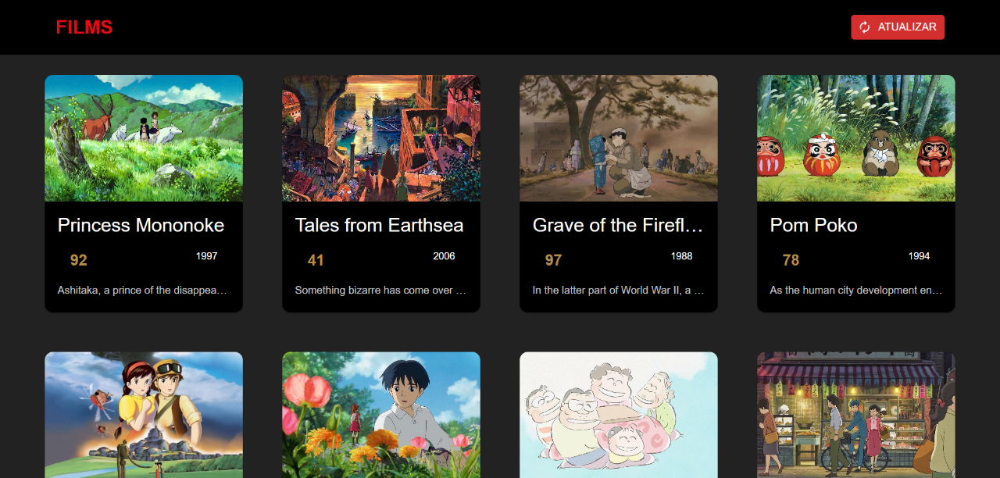
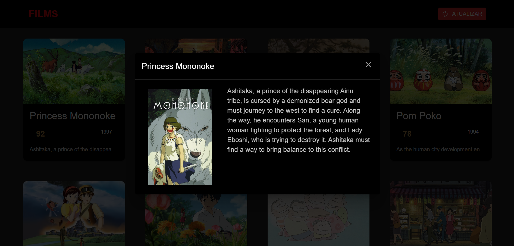

# 💻 Films application - Front-end

### Run Application

```bash
$ npm start
```

### About

Films application, created using React.

This films app searches Studio Ghibli films via API.
Records in MySQL database and lists the films, where you can see their detailed description.

## 🔖 Layout

<table>
  <tr>
    <td><strong>Listing</strong></td>
    <td><strong>Detailed View</strong></td>
  <tr>

   <tr>
    <td></td>
    <td></td>
  <tr>
</table>
